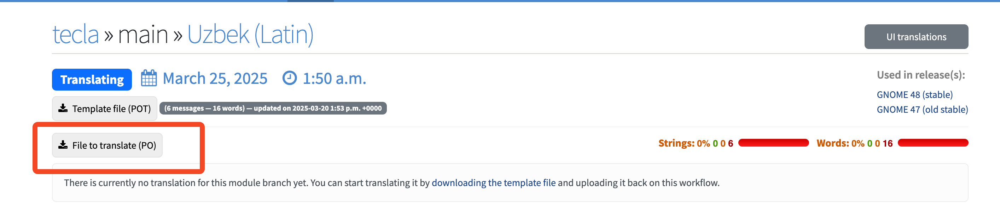
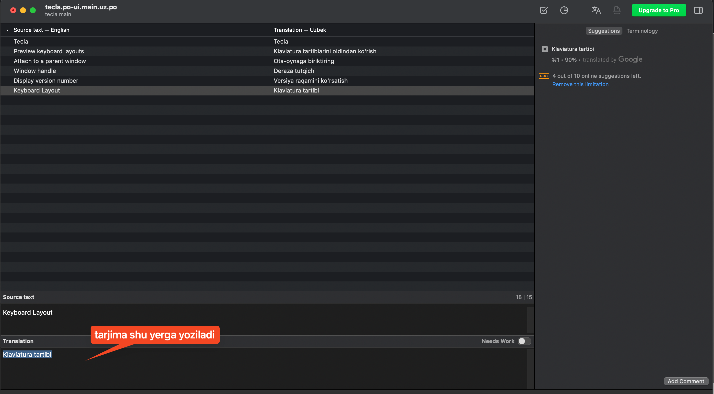

# GNOME Linux ga o‘zbek tilini qo‘shish

GNOME – bu Linux operatsion tizimida ishlatiladigan ish stoli muhiti (inglizcha: [desktop environment](https://en.wikipedia.org/wiki/Desktop_environment)).

GNOME tarkibiga kalkulyator, kalendar, kamera, soat, terminal, ob-havo kabi kunlik hayotda zarur bo‘lgan ilovalar to‘plami kiradi.

Ishda brauzer, Telegram, Microsoft Word, kalkulyator kabi dasturlardan foydalanganimizda, ko‘pchilikda ular oldindan rus yoki ingliz tilida sozlangan bo‘ladi. Agar o‘zbek tili mavjud bo‘lmasa, majburan boshqa tillardan foydalanamiz. Natijada, kundalik nutqimizga skachat, efir, podpischik, nastroyka kabi so‘zlar aralashib, ularning o‘zbekcha muqobillari yodimizdan chiqib ketishi mumkin.

2025-yil 25-mart holatiga ko‘ra, GNOME 48.0 versiyasining tarjima qilingan ulushi quyidagicha:

- Qozoq tili – 63%
- Tojik tili – 26%
- Qirg‘iz tili – 11%
- O‘zbek tili – atigi 6%

Bu holatni yaxshilash uchun har birimiz o‘z hissamizni qo‘shishimiz kerak.

> Agar biz bugun bu ishlarni qilmasak unda kim qiladi? "Keyingi avlod da bo‘lib qolar..." deydigan keyingi avloddami? - [Orzklv](https://orzklv.uz/uz)

## Ro‘yxatdan o‘tish

https://l10n.gnome.org/register havolasiga kirib kerakli ma’lumotlarni kiritamiz.


https://l10n.gnome.org/teams/uz o‘zbek guruhiga qo‘shilamiz


https://l10n.gnome.org/languages/uz/gnome-48/ui havolasiga o‘tib tarjima qilinmagan modullarni ko‘rishimiz mumkin.


Ko‘rishingiz mumkin yashil va qizil ranglar qanchalik tarjima qilingan yoki qilinmaganligini bildiradi. Quyidagi “libsecret” moduli tarjima qilingan lekin “tecla” qizil rangda. “Tecla”ni tarjima qilish uchun ustiga bosamiz.


Bizga kerakli .po faylni yuklab olamiz



.po fayl bilan ishlash uchun [Poedit](https://poedit.net/) ishlataman va shu dasturda tarjima qilishni maslahat beraman. Quyida Ubuntu va Mac uchun yuklab olish:

### Ubuntu

```
sudo apt-get poedit -y
```

### MacOs

```
brew install --cask poedit
```



Chap tomonda inglizcha matn, o‘ng tomonda esa uning o‘zbekcha tarjimasi ko‘rsatiladi. Pastroqda joylashgan "**Translation**" maydoniga o‘zbekcha tarjimani kiritishingiz kerak. Quyidagi qoidalarga amal qilish lozim:

- Inglizcha so‘z bosh harf yoki kichik harf bilan boshlangan bo‘lsa, o‘zbekcha tarjimada ham shu tartibga rioya qilinadi.

- Agar inglizcha matn nuqta bilan tugasa, o‘zbekcha tarjima ham nuqta bilan tugashi kerak.

- Tarjima tugagach, faylni saqlang va modul sahifasida "Upload new translation" tugmasini bosib, .po faylini yuklang.


Qilgan tarjimangiz tez orada guruh administratori tomonidan ko‘rib chiqiladi. Sizga izoh qoldiriladi va ro‘yxatdan o‘tgan email manzilingizga xabar yuboriladi.

Agar o‘zingiz tanlagan modulni oldindan band qilib qo‘ysangiz, boshqa tarjimonlar uni ishlashga olmagan bo‘lishadi. Biroq, uni qanchada tugatishingizni izohda (kommentariyda) ko‘rsatib qo‘yish maqsadga muvofiq.


E’tiboringiz uchun rahmat !
